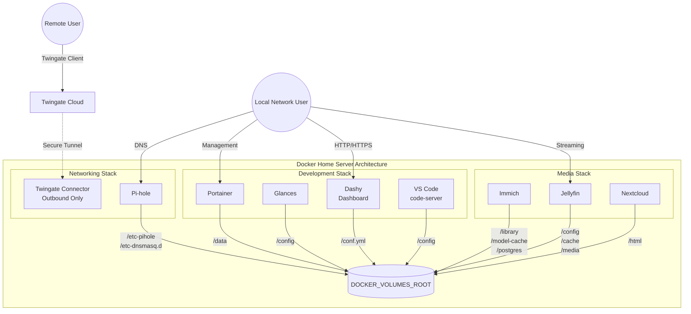

# Unified Docker Home Server Architecture

This repository provides a unified architecture for a containerized home server, smartly isolated into three distinct technology stacks: **Networking**, **Development**, and **Media**.

To simplify backups and data management, all persistent data is centralized and shared across all stack init containers and bind mounts under one host root directory, configured via the **`DOCKER_VOLUMES_ROOT`** variable.

## 📑 Table of Contents

- [Prerequisites](#prerequisites)
- [Architecture & Stacks](#architecture--stacks)
- [Installation & Setup](#installation--setup)
- [Service URLs](#service-urls)
- [Remote Access](#remote-access)

## ⚙️ Prerequisites

Before starting, ensure you have the following installed on your host machine:

- **Docker**
- **Docker Compose plugin** (`docker compose`)

## 🏗️ Architecture & Stacks

The environment is split into three separate stacks using Docker Compose files:

1. **Networking Stack** (`docker-compose.yml`): Includes Pi-hole for DNS/ad-blocking and the Twingate Connector for secure remote access.
2. **Development Stack** (`stacks/development/docker-compose.yml`): Includes Portainer for container management, Glances for system monitoring, Dashy for your homepage, and VS Code (`code-server`) for remote development.
3. **Media Stack** (`stacks/media/docker-compose.yml`): Includes Immich for photo management, Jellyfin for media streaming, and Nextcloud for file hosting.

## 🚀 Installation & Setup

### 1. Environment Configuration

Create or update your `.env` file in the project root by copying the provided `.env.example` file.

- Set `DOCKER_VOLUMES_ROOT` to a single absolute path on your host (default: `/home/docker-volume`).
- Set `SERVER_IP` to your host LAN/Wi-Fi IP. This single variable is used for:
  - Pi-hole DNS bind on port 53 in the networking stack.
  - Generated Dashy service URLs in the development stack init config.

### 2. Volume Initialization

Initialization logic is organized within each stack's directory. When you run the initialization scripts, the following directory structures are automatically created under your `DOCKER_VOLUMES_ROOT`:

- **Networking (`stacks/networking/init.sh`)**: Sets up `/pihole/etc-pihole` and `/pihole/etc-dnsmasq.d`.
- **Development (`stacks/development/init.sh`)**: Sets up `/portainer/data`, `/glances/config` (including a default `glances.conf`), `/code-server/config`, and `/dashy/conf.yml` (pre-configured with groups for Networking, Development, and Media). The generated Dashy config uses `SERVER_IP` plus your configured service port variables, and applies a colorful default theme (`aurora-pop`).
- **Media (`stacks/media/init.sh`)**: Sets up `/immich/library`, `/immich/model-cache`, `/immich/postgres`, `/jellyfin/config`, `/jellyfin/cache`, `/jellyfin/media`, and `/nextcloud/html`.

### 3. Running the Server

You can start or stop the entire architecture easily using the included helper script, which coordinates the networking, development, and media stacks together.

**Start all stacks together:**

```bash
# Start the unified environment
sudo chmod +x ./stack.sh
sudo ./stack.sh up
```

_(Note: Use the helper script to run all three compose files together with one command.)_

**Stop all stacks together:**

```bash
# Stop the unified environment
sudo ./stack.sh down
```

## 🌐 Service URLs

Once your stacks are up and running, you can access your services locally via the following URLs (replace `<SERVER_IP>` with the value of `SERVER_IP` in your `.env`):

- **Dashy (Dashboard):** `http://<SERVER_IP>:<DASHY_PORT>`
- **Pi-hole Admin:** `http://<SERVER_IP>:<PIHOLE_WEB_LOCAL_PORT>/admin`
- **Portainer:** `http://<SERVER_IP>:<PORTAINER_HTTP_PORT>` (or HTTPS via `https://<SERVER_IP>:<PORTAINER_HTTPS_PORT>`)
- **Glances:** `http://<SERVER_IP>:<GLANCES_PORT>`
- **VS Code (code-server):** `http://<SERVER_IP>:<VSCODE_PORT>`
- **Immich:** `http://<SERVER_IP>:<IMMICH_PORT>`
- **Jellyfin:** `http://<SERVER_IP>:<JELLYFIN_PORT>`
- **Nextcloud:** `http://<SERVER_IP>:<NEXTCLOUD_PORT>`

## 🔒 Remote Access

Remote access to your home server is securely handled by the **Twingate Connector**. The Twingate Connector runs strictly as an **outbound-only connection**, meaning it safely tunnels you into your network without exposing any local web UI or open ports to the public internet.

### Architecture Flow Diagram


