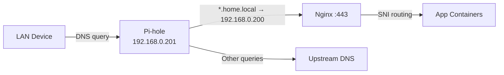

# 🚀 Home Server — System & Network Design

[](LICENSE)

A Docker Compose-based home server stack for self-hosting media, files, photos, automation, DNS, and remote access behind a local HTTPS reverse proxy. This repository is designed to be reusable: network values, storage paths, domains, and secrets are configurable through `.env`.

## Features

- Split-stack design: core services and remote-access services can be operated independently
- Local HTTPS with a private Certificate Authority for `*.home.local`
- Pi-hole DNS with LAN-wide `home.local` service discovery
- Reverse-proxied access to media, storage, and admin apps
- Configurable storage paths via `.env` (including `${DOCKER_VOLUMES_ROOT}`)
- Operational docs for backup, updates, TLS renewal, troubleshooting, and maintenance

---

## 📐 Architecture Overview

```
┌─────────────────────────────────────────────────────────────────────────┐
│  Mini PC  (Ubuntu Linux · 192.168.0.200)                                │
│                                                                         │
│  ┌─────────────────────────────────────────────────────────────────┐    │
│  │  Docker Engine                                                  │    │
│  │                                                                 │    │
│  │  ┌─────────────┐   ┌────────────────────────────────────────┐   │    │
│  │  │ macvlan_net │   │  proxy_net (bridge)                    │   │    │
│  │  │             │   │                                        │   │    │
│  │  │  Pi-hole    │   │  Nginx (:80/:443)                      │   │    │
│  │  │  .201       │   │    ├── Dashy        ├── Jellyfin       │   │    │
│  │  └─────────────┘   │    ├── VSCode       ├── qBittorrent    │   │    │
│  │                    │    ├── Portainer    ├── Immich         │   │    │
│  │                    │    ├── Glances      ├── Filebrowser    │   │    │
│  │                    │    └── Nextcloud                       │   │    │
│  │                    └────────────────────────────────────────┘   │    │
│  │                                                                 │    │
│  │  ┌──────────────┐  ┌──────────────┐  ┌──────────────────────┐  │    │
│  │  │ monitor_net  │  │  immich_net  │  │   nextcloud_net      │  │    │
│  │  │ DockerProxy  │  │  Redis       │  │   MySQL 8.0          │  │    │
│  │  │ Portainer    │  │  PostgreSQL  │  └──────────────────────┘  │    │
│  │  │ Glances      │  │  ML (OpenVINO)│                           │    │
│  │  └──────────────┘  └──────────────┘                            │    │
│  │                                                                 │    │
│  │  ── Access Stack (separate lifecycle) ──────────────────────    │    │
│  │  Twingate Connector (host network)                              │    │
│  │  n8n ←→ Tailscale sidecar (ts-n8n)                              │    │
│  │  Hermes ←→ Tailscale sidecar (ts-hermes)                        │    │
│  └─────────────────────────────────────────────────────────────────┘    │
│                                                                         │
│  Storage:                                                               │
│    ${DOCKER_VOLUMES_ROOT}  ── service configs, media, photos, databases│
└─────────────────────────────────────────────────────────────────────────┘
```

---

## ⚡ Quick Start

The recommended setup path is the automated installer:

```bash
git clone <your-fork-or-this-repo-url> home-server
cd home-server
cp .env.example .env
# Edit .env and replace all CHANGE_ME values
sudo bash install.sh
```

After installation:

1. Configure your router DHCP to hand out Pi-hole as the DNS server.
2. Trust the local CA certificate on each device.
3. Open `https://home.local` (or your configured `${BASE_DOMAIN}`).

> If `.env` is missing, `install.sh` will create it from `.env.example` and stop so you can fill in secrets before continuing.

---

## 🌐 Network Design

Example LAN values are shown below; adjust them to your network in `.env`.

### Subnet & IPs

| Role | Example IP / Range |
|------|--------------------|
| LAN subnet | `192.168.0.0/24` |
| Gateway | `192.168.0.1` |
| Server (host) | `192.168.0.200` |
| Pi-hole (macvlan) | `192.168.0.201` |
| macvlan parent | `eno2` |

### Docker Networks

| Network | Driver | Purpose |
|---------|--------|---------|
| `macvlan_net` | macvlan | Gives Pi-hole its own LAN IP so it can serve as the network DNS |
| `proxy_net` | bridge | Connects all web-facing services to the Nginx reverse proxy |
| `monitor_network` | bridge | Isolates Docker socket proxy, Portainer, and Glances |
| `immich_net` | bridge | Private network for Immich, Redis, PostgreSQL, and ML |
| `nextcloud_net` | bridge | Private network for Nextcloud and its MySQL database |

### DNS & Routing Flow



`SERVER_IP` in `.env` is the single source of truth for service DNS targets. Run `bash scripts/setup/sync-network-configs.sh` after changing it to update generated config files such as `pihole/dnsmasq.d/05-home-local.conf` and Dashy CA links.

All `*.home.local` A records are managed in `pihole/dnsmasq.d/05-home-local.conf` and resolve to the server IP. Router DHCP should hand out Pi-hole as the DNS server.

### Remote Access

| Method | Scope |
|--------|-------|
| **Twingate** | Zero-trust connector on host network for LAN services |
| **Tailscale Funnel** | Optional public exposure for selected services such as n8n and Hermes |

The access stack (`docker-compose.access.yml`, project `home-access`) is kept separate so remote access can remain available during app-stack maintenance.

#### Twingate Setup

The Twingate connector runs on the host and resolves DNS locally. Because the host cannot reach Pi-hole on macvlan directly, `*.home.local` entries are also added to `/etc/hosts` on the server:

```text
192.168.0.200 home.local dashy.home.local vscode.home.local portainer.home.local glances.home.local nextcloud.home.local jellyfin.home.local qbittorrent.home.local immich.home.local files.home.local
```

#### Suggested Twingate Resources

| Resource | Example Address | Purpose |
|----------|-----------------|---------|
| All home services | `*.home.local` | All reverse-proxied services |
| Pi-hole Admin | `192.168.0.201` | Pi-hole management UI |
| Primary router | `192.168.0.1` | LAN router admin panel |
| Upstream router | `10.10.1.1` | Optional upstream router admin panel |
| Server direct | `192.168.0.200` | Direct server access |

#### How it works

1. Twingate client on a remote device intercepts traffic to matched resources.
2. Traffic is routed to the Twingate connector on the server host.
3. The connector resolves `*.home.local` via `/etc/hosts` to the server IP.
4. IP-based resources route directly.
5. Nginx terminates TLS and proxies to the correct container.

#### Remote device setup

1. Install the Twingate client and sign in.
2. Download the CA certificate from `https://home.local/ca.crt`.
3. Trust the CA certificate in your OS or browser.

> The `*.home.local` wildcard covers current and future subdomains. When adding a new service, update local DNS and host resolution, but you usually do not need to add a new wildcard resource in Twingate.

---

## 🔒 TLS (Local CA)

A private Certificate Authority issues certificates for `*.home.local`:

```text
nginx/ca/home-local-ca.crt    ← CA root (trust once on each device)
nginx/certs/home.local.crt    ← Leaf certificate
nginx/certs/home.local.key    ← Private key
```

### TLS Scripts

| Script | Purpose |
|--------|---------|
| `scripts/tls/create-local-ca.sh` | One-time CA creation |
| `scripts/tls/issue-home-local-cert.sh` | Issue leaf certificate and reload Nginx |
| `scripts/tls/renew-home-local-cert.sh` | Renew leaf certificate |

Trust the CA on each device by downloading `https://home.local/ca.crt` (or `http://192.168.0.200/ca.crt` before trust is set up; adjust to your network) and verify the SHA-256 fingerprint:

```bash
openssl x509 -in nginx/ca/home-local-ca.crt -noout -fingerprint -sha256
```

### Per-platform installation

| Platform | Steps |
|----------|-------|
| **Windows** | Double-click `.crt` → Install Certificate → Local Machine → Trusted Root Certification Authorities |
| **macOS** | Double-click → Keychain Access → Trust → Always Trust |
| **Linux** | `sudo cp <base-domain>-ca.crt /usr/local/share/ca-certificates/ && sudo update-ca-certificates` |
| **iOS** | Open in Safari → Install Profile → Settings → General → About → Certificate Trust Settings → Enable |
| **Android** | Settings → Security → Install a certificate → CA certificate |
| **Firefox** | Settings → Privacy & Security → Certificates → View Certificates → Import |

---

## 🐳 Services

### Main Stack (`docker-compose.yml` — project `home-server`)

| Service | Image | Network | Description |
|---------|-------|---------|-------------|
| **Nginx** | `nginx:1.27-alpine` | `proxy_net` | HTTPS reverse proxy for all web apps |
| **Pi-hole** | `pihole/pihole` | `macvlan_net`, `monitor` | Network-wide DNS and ad blocking |
| **Dashy** | `lissy93/dashy` | `proxy_net` | Dashboard / homepage |
| **VSCode** | `coder/code-server` | `proxy_net` | Web-based IDE |
| **Portainer** | `portainer-ce:lts` | `monitor`, `proxy_net` | Docker management UI |
| **Docker Proxy** | `tecnativa/docker-socket-proxy` | `monitor` | Secure Docker socket access |
| **Glances** | `nicolargo/glances` | `monitor`, `proxy_net` | System monitoring |
| **Nextcloud** | `nextcloud` | `nextcloud_net`, `proxy_net` | Self-hosted file sync and share |
| **Nextcloud DB** | `mysql:8.0` | `nextcloud_net` | MySQL for Nextcloud |
| **Jellyfin** | `jellyfin/jellyfin` | `proxy_net` | Media streaming server |
| **qBittorrent** | `linuxserver/qbittorrent` | `proxy_net` | Torrent client |
| **Immich** | `immich-server` | `immich_net`, `monitor`, `proxy_net` | Photo and video management |
| **Immich ML** | `immich-machine-learning` | `immich_net` | AI-powered photo features |
| **Redis** | `valkey:9` | `immich_net` | Cache for Immich |
| **PostgreSQL** | `ghcr.io/immich-app/postgres:14-*` | `immich_net` | Database for Immich |
| **Filebrowser** | `filebrowser/filebrowser` | `proxy_net` | Web file manager |

### Access Stack (`docker-compose.access.yml` — project `home-access`)

| Service | Image | Network | Description |
|---------|-------|---------|-------------|
| **Twingate** | `twingate/connector:1` | `host` | Zero-trust network connector |
| **ts-n8n** | `tailscale/tailscale` | sidecar | Tailscale node for n8n |
| **n8n** | `n8nio/n8n` | shares `ts-n8n` network | Workflow automation |
| **ts-hermes** | `tailscale/tailscale` | sidecar | Tailscale node for Hermes |
| **Hermes** | `nousresearch/hermes-agent:latest` | shares `ts-hermes` network | AI gateway |

---

## 🌍 Service URLs

The default examples below assume `BASE_DOMAIN=home.local`.

| Service | URL |
|---------|-----|
| Home (redirects to Dashy) | `https://home.local` |
| Dashy | `https://dashy.home.local` |
| VSCode (via Nginx) | `https://vscode.home.local` |
| VSCode (direct, no Nginx required) | `http://${SERVER_IP}:${VSCODE_HOST_PORT}` |
| Portainer | `https://portainer.home.local` |
| Portainer (direct, no Nginx required) | `http://${SERVER_IP}:${PORTAINER_HOST_PORT}` |
| Glances | `https://glances.home.local` |
| Nextcloud | `https://nextcloud.home.local` |
| Jellyfin | `https://jellyfin.home.local` |
| qBittorrent | `https://qbittorrent.home.local` |
| Immich | `https://immich.home.local` |
| Filebrowser | `https://files.home.local` |
| Pi-hole Admin | `http://${PIHOLE_IP}/admin` |
| n8n | Access via your chosen remote-access method |

### Pi-hole Local DNS entries for running services

For each reverse-proxied service you run, Pi-hole should map that FQDN to `${SERVER_IP}`.

Default records (replace `home.local` with your `BASE_DOMAIN`):

```text
address=/home.local/${SERVER_IP}
address=/dashy.home.local/${SERVER_IP}
address=/vscode.home.local/${SERVER_IP}
address=/portainer.home.local/${SERVER_IP}
address=/glances.home.local/${SERVER_IP}
address=/nextcloud.home.local/${SERVER_IP}
address=/jellyfin.home.local/${SERVER_IP}
address=/qbittorrent.home.local/${SERVER_IP}
address=/immich.home.local/${SERVER_IP}
address=/files.home.local/${SERVER_IP}
```

Keep entries only for services you actually run. New services can be added with `scripts/dns/add-service-dns.sh`.

---

## 💾 Storage Layout

Storage paths are configurable via `.env`. `${DOCKER_VOLUMES_ROOT}` is the main root for service state.

```text
${DOCKER_VOLUMES_ROOT}/
├── pihole/
├── dashy/
├── portainer/
├── glances/
├── nextcloud/        # html + db
├── jellyfin/         # config + cache
├── qbittorrent/
├── immich/postgres
├── filebrowser/
├── n8n/
├── hermes/
├── tailscale-n8n/
├── tailscale-hermes/
└── vscode/           # VSCode workspace + config

${DOCKER_VOLUMES_ROOT}/
├── jellyfin/media/
├── downloads/
├── immich/
└── nextcloud/data/
```

### Example `fstab` entry

If you want a dedicated disk for this stack, mount it at `${DOCKER_VOLUMES_ROOT}`:

```fstab
UUID=<your-drive-uuid>  /home/docker-volumes  ext4  defaults,nofail,x-systemd.device-timeout=10s  0  2
```

---

## 🚀 Setup Guide

### Recommended: automated installation

Use the installer as the primary setup path:

```bash
sudo bash install.sh
```

The installer:

1. Validates Docker and Docker Compose
2. Creates `.env` from `.env.example` if needed
3. Auto-refreshes `.env` network values (`SERVER_IP`, `MACVLAN_SUBNET`, `MACVLAN_GATEWAY`) when host network changes
4. Prepares host directories with correct ownership
5. Generates local TLS assets
6. Starts both Compose stacks

### Manual Setup

Use the manual process if you want full control over each step.

#### 1. Install Docker and the Compose plugin

```bash
sudo apt-get update
sudo apt-get install ca-certificates curl gnupg -y
sudo install -m 0755 -d /etc/apt/keyrings
curl -fsSL https://download.docker.com/linux/ubuntu/gpg | sudo gpg --dearmor -o /etc/apt/keyrings/docker.gpg
echo "deb [arch=$(dpkg --print-architecture) signed-by=/etc/apt/keyrings/docker.gpg] https://download.docker.com/linux/ubuntu $(lsb_release -cs) stable" | sudo tee /etc/apt/sources.list.d/docker.list > /dev/null
sudo apt-get update
sudo apt-get install docker-ce docker-ce-cli containerd.io docker-compose-plugin -y
```

#### 2. Mount docker-volumes storage

```bash
sudo mkdir -p /home/docker-volumes
# Add your UUID-based entry to /etc/fstab
sudo mount -a
```

#### 3. Prepare service directories

```bash
sudo bash ./scripts/setup/prepare-service-paths.sh
```

Ownership defaults:

| Scope | Owner | Mode |
|-------|-------|------|
| App data | `1000:1000` | `775` |
| Nextcloud DB (MySQL) | `999:999` | `750` |
| Nextcloud app/data | `33:33` | `750` |
| Immich Postgres | `1000:1000` | `775` |
| Tailscale state | `root:root` | `700` |

#### 4. Configure environment

```bash
cp .env.example .env
# Edit .env and replace all CHANGE_ME values
```

#### 5. Create the local CA and certificates

```bash
bash ./scripts/tls/create-local-ca.sh
bash ./scripts/tls/issue-home-local-cert.sh --reload
```

#### 6. Start the stacks

```bash
docker compose -f docker-compose.access.yml up -d
docker compose -f docker-compose.yml up -d vscode
docker compose -f docker-compose.yml up -d
```

---

## 🔐 Secrets & Configuration

- Copy `.env.example` to `.env` and keep `.env` out of version control.
- Replace all `CHANGE_ME_*` placeholders before starting the stack.
- Configure paths, network values, and domains in `.env` to match your environment.
- For CI or deployment workflows, store secrets in your platform secret manager.
- Generate strong passwords with:

```bash
head -c 32 /dev/urandom | base64
```

If you discover committed secrets, rotate them immediately and then clean repository history if necessary.

---

## 🧯 Operations

### Safe stop / update

```bash
# Stop only the main app stack
docker compose -f docker-compose.yml down

# Stop only the access stack
docker compose -f docker-compose.access.yml down
```

### Certificate renewal

Example weekly cron entry:

```cron
0 3 * * 0 cd /path/to/home-server && bash ./scripts/tls/renew-home-local-cert.sh >> /var/log/home-local-cert-renew.log 2>&1
```

### Pi-hole password reset

```bash
sudo docker exec -it pihole pihole setpassword
```

### VSCode Git ownership fix

```bash
sudo chown -R 1000:1000 "${VSCODE_WORKSPACE}/projects/.git"
```

### VSCode persistence

VSCode can persist its workspace, settings, SSH keys, and extensions via the `${VSCODE_WORKSPACE}` bind mount.

**Volume mapping:**

```yaml
${VSCODE_WORKSPACE}:/home/coder
```

If you prefer the split layout used by the current Compose file:

```yaml
${VSCODE_WORKSPACE}/projects:/home/coder/projects
${VSCODE_WORKSPACE}/config:/home/coder/.local/share/code-server
```

**One-time setup example:**

```bash
sudo mkdir -p "${VSCODE_WORKSPACE}/projects" "${VSCODE_WORKSPACE}/config"
sudo chown -R 1000:1000 "${VSCODE_WORKSPACE}"
chmod 755 "${VSCODE_WORKSPACE}"
```

### Generic Git configuration

```bash
git config --global user.name "Your Name"
git config --global user.email "you@example.com"
```

### Optional SSH key setup for VSCode

```bash
sudo mkdir -p "${VSCODE_WORKSPACE}/.ssh"
sudo cp ~/.ssh/id_rsa "${VSCODE_WORKSPACE}/.ssh/"
sudo cp ~/.ssh/id_rsa.pub "${VSCODE_WORKSPACE}/.ssh/"
sudo chmod 700 "${VSCODE_WORKSPACE}/.ssh"
sudo chmod 600 "${VSCODE_WORKSPACE}/.ssh/id_rsa"
sudo chmod 644 "${VSCODE_WORKSPACE}/.ssh/id_rsa.pub"
sudo chown -R 1000:1000 "${VSCODE_WORKSPACE}/.ssh"
```

### Storage troubleshooting

```bash
lsblk
sudo mount /dev/sdb2 /home/docker-volumes
sudo hdparm -S 0 /dev/sdb
```

---

## 🔄 Backup Procedure

```bash
sudo mount /dev/sdc1 /mnt/backup-drive
sudo mkdir -p /mnt/backup-drive/docker-volumes-backup

sudo rsync -avh --progress "${DOCKER_VOLUMES_ROOT}/" /mnt/backup-drive/docker-volumes-backup/

ls /mnt/backup-drive/docker-volumes-backup
```

---

## ⚠️ Known Issues & Troubleshooting

### Pi-hole v6: `dnsmasq.d` configs not loaded

Pi-hole v6 does not read `/etc/dnsmasq.d/` by default unless explicitly enabled:

```bash
docker exec pihole pihole-FTL --config misc.etc_dnsmasq_d true
docker exec pihole pihole reloaddns
```

This is also set declaratively in `docker-compose.yml`:

```yaml
FTLCONF_misc_etc_dnsmasq_d: "true"
```

### Host cannot reach Pi-hole on macvlan

Docker macvlan containers are isolated from the host by design. The host cannot communicate directly with Pi-hole on its LAN IP. Workarounds:

- Use `/etc/hosts` on the host for `*.home.local` resolution
- Or create a macvlan shim interface if your environment requires it

### Host DNS resolution (`/etc/resolv.conf`)

The host uses `systemd-resolved` (stub at `127.0.0.53`). Since the host cannot reach Pi-hole on macvlan, it relies on upstream DNS for external lookups.

**Quick fix if external DNS breaks:**

```bash
sudo rm /etc/resolv.conf
echo "nameserver 1.1.1.1" | sudo tee /etc/resolv.conf
echo "nameserver 8.8.8.8" | sudo tee -a /etc/resolv.conf
```

**More permanent fix:**

```bash
sudo sed -i '/\[Resolve\]/a DNS=1.1.1.1 8.8.8.8' /etc/systemd/resolved.conf
sudo systemctl restart systemd-resolved
sudo ln -sf /run/systemd/resolve/stub-resolv.conf /etc/resolv.conf
```

### Devices not resolving `*.home.local`

1. Ensure router DHCP hands out Pi-hole as the DNS server.
2. Flush DNS and renew the device lease.
   - **Windows:** `ipconfig /flushdns && ipconfig /release && ipconfig /renew`
   - **macOS:** `sudo dscacheutil -flushcache`
   - **iPhone / Android:** toggle Wi-Fi off/on or renew lease
3. Check whether IPv6 Router Advertisement DNS is overriding DHCP-provided DNS.

### TLS certificate not trusted on iOS / iPadOS

After downloading the CA certificate:

1. Install the profile: **Settings → General → VPN & Device Management**
2. Enable trust: **Settings → General → About → Certificate Trust Settings**
3. If still marked insecure, delete old home-lab CA profiles/certs and install the latest `${BASE_DOMAIN}-ca.crt` again.

### TLS certificate not trusted on Linux

Install the CA system-wide (opening the `.crt` file directly is often not enough):

```bash
sudo cp ~/Downloads/<base-domain>-ca.crt /usr/local/share/ca-certificates/<base-domain>-ca.crt
sudo update-ca-certificates
```

Then restart your browser.

### TLS certificate not trusted on Windows

1. Open **Manage user certificates** (or `certmgr.msc`).
2. Import `<base-domain>-ca.crt` into **Trusted Root Certification Authorities → Certificates**.
3. Remove older/duplicate home-lab CA entries if present, then reopen the browser.

### Android works by IP but not by DNS

- HTTPS by IP is expected to fail hostname validation; use DNS names like `https://dashy.<base-domain>`.
- If DNS names fail only on Android, disable **Private DNS / Secure DNS / DNS over HTTPS** for that Wi-Fi so queries go to Pi-hole.
- Reconnect Wi-Fi after changing DNS settings.

### Verify DNS resolution

```bash
# From the server, inside Pi-hole
docker exec pihole dig dashy.home.local @127.0.0.1 +short

# From any LAN device
nslookup dashy.home.local 192.168.0.201

# From the server host
getent hosts dashy.home.local
```

### Adding a new service

Use the helper script:

```bash
sudo bash scripts/dns/add-service-dns.sh <subdomain> [port] [--reload]

# Example
sudo bash scripts/dns/add-service-dns.sh grafana 3000 --reload
```

The script automatically:

1. Adds a DNS record to `pihole/dnsmasq.d/05-home-local.conf`
2. Adds an `/etc/hosts` entry on the server
3. Optionally reloads Pi-hole
4. Uses `SERVER_IP` from `.env` (single source of truth)

**Then complete these manual steps:**

4. Add an Nginx server block to `nginx/conf.d/home-server.conf`
5. Add the FQDN to the HTTP→HTTPS redirect `server_name` list
6. Reload Nginx: `docker exec nginx-proxy nginx -s reload`
7. Optionally add an entry to `dashy/conf.yaml`

---

## 🛠️ Nextcloud Maintenance

### Routine file cleanup and scan

If you encounter indexing issues or template inconsistencies:

1. Clear merged templates:

```bash
docker compose exec --user root nextcloud bash -lc 'find /var/www/html/data -name "merged-template*" -delete'
```

2. Run maintenance repair:

```bash
docker compose exec --user www-data nextcloud php /var/www/html/occ maintenance:repair
```

3. Force a full file system scan:

```bash
docker compose exec --user www-data nextcloud php /var/www/html/occ files:scan --all
```

### Restarting the service

```bash
docker compose stop nextcloud
docker compose up -d nextcloud
```

---

## 🤝 Contributing

Contributions are welcome. See [CONTRIBUTING.md](CONTRIBUTING.md) for development workflow, standards, and contribution guidelines.
